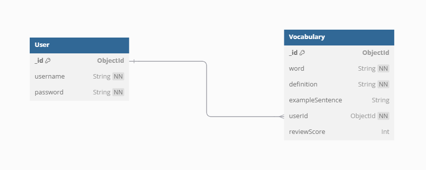
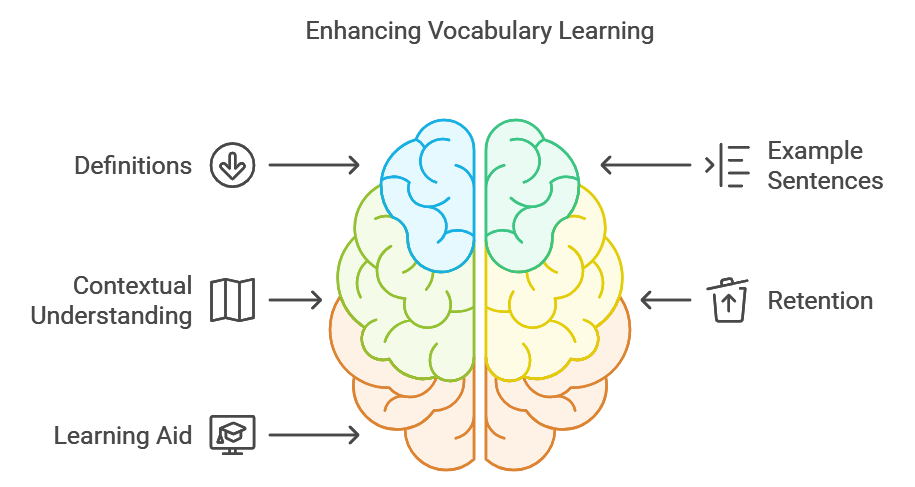
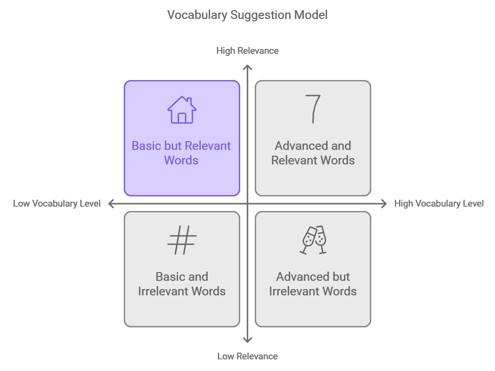
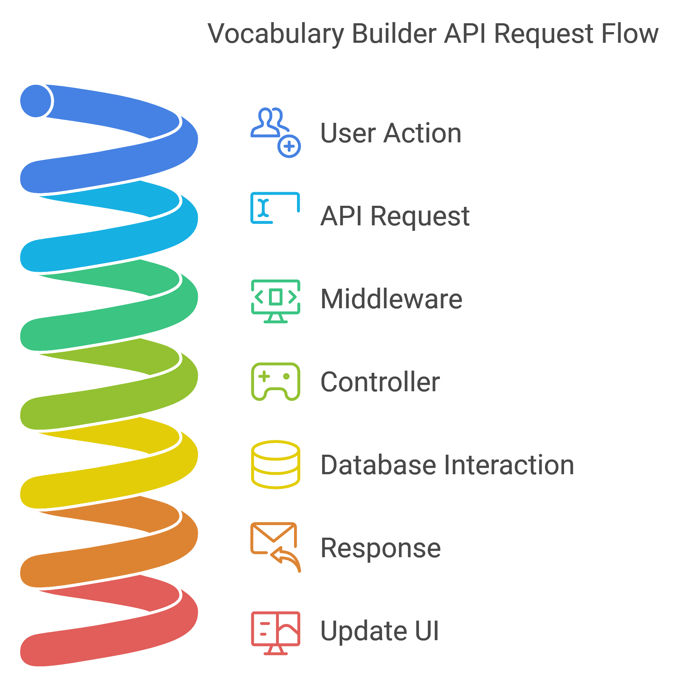

# Vocabulary Builder Documentation

## Table of Contents
1. [Database Documentation](#database-documentation)
2. [Frontend Documentation](#frontend-documentation)
3. [Backend Documentation](#backend-documentation)
4. [Installation and Setup](#installation-and-setup)
5. [Usage Instructions](#usage-instructions)

## Database Documentation
### Schemas
- **User Schema**
  - `username`: required, unique
  - `password`: required
- **Vocabulary Schema**
  - `word`: required
  - `definition`: required
  - `exampleSentence`
  - `userId`: references User
  - `reviewScore`: default 0 (max 5)
<div style="text-align: center;">
    
</div>

## Frontend Documentation

The frontend of the Vocabulary Builder application is built using React. It provides a user-friendly interface for interacting with the backend API and managing vocabulary. The frontend is organized into four main folders: `pages`, `components`, `services`, and `styles`.

### Folder Structure

#### Pages
- **Home**: The landing page with options to sign in or sign up and an option to play a game context.
- **Vocabulary**: The main page for managing vocabulary words.

#### Components
The `components` folder contains reusable components, primarily used within the Vocabulary page:
- **Add Word Form**: A form for users to add new vocabulary words.
- **Sidebar**: Navigation component for accessing different sections of the app.
- **Suggested Word**: Displays words suggested by the AI model based on user vocabulary.
- **Update Word Form**: A form for updating existing vocabulary words.
- **Vocabulary Card**: Displays individual vocabulary words with their definitions and options to update or delete.
- **Modal**: Used for displaying pop-up information or confirmations.

Each component has its own dedicated CSS file located in the `styles` folder to maintain styles specific to that component, ensuring a clean separation of styling and functionality.

#### Services
The `services` folder handles interactions with the backend API:
- **Auth Service**: Manages user authentication for sign in and sign up functionalities.
- **Generate Definition**: Service for fetching definitions and example sentences using an AI model.
- **VocabService**: Manages API endpoints for CRUD operations on vocabulary words.

### AI Models
The application utilizes two AI models for enhancing vocabulary management:

1. **Sentence and Definition Generator**: This model retrieves definitions and example sentences for vocabulary words, providing context for each word. By integrating this model, users can gain a deeper understanding of each word's usage in sentences, which aids in retention and learning.
  

2. **Suggested Words Generator**: This model generates a list of suggested vocabulary words tailored to the user's existing vocabulary. It takes into account the user's current knowledge level, allowing for personalized suggestions that encourage language expansion. By analyzing the user's review scores and previously known words, this model helps users discover new words that are relevant and manageable.
  

This structured approach ensures a clean separation of concerns within the application, making it easier to maintain and scale.

## Backend Documentation
The backend of the Vocabulary Builder application is built using Node.js and Express. It serves as the API layer for handling data requests between the frontend and the MongoDB database. The backend is responsible for user authentication, CRUD operations for vocabulary words, and integration with external APIs for word definitions.
<div style="text-align: center;">
    
</div>

---

### API Endpoints

#### User Endpoints

- **POST** `/api/users`: Create a new user
  - **Request Body**:
    ```json
    {
      "username": "exampleUser",
      "password": "examplePassword"
    }
    ```
  - **Response**:
    - **201 Created**: User successfully created.
    - **400 Bad Request**: If username or password is missing.

---

- **GET** `/api/users`: Get all users
  - **Response**:
    - **200 OK**: Returns a list of all users.

---

- **GET** `/api/users/:id`: Get user details by ID
  - **Response**:
    - **200 OK**: Returns user details.
    - **404 Not Found**: If user does not exist.

---

- **PUT** `/api/users/:id`: Update a user by ID
  - **Request Body**:
    ```json
    {
      "username": "newUsername",
      "password": "newPassword"
    }
    ```
  - **Response**:
    - **200 OK**: User successfully updated.
    - **404 Not Found**: If user does not exist.

---

- **DELETE** `/api/users/:id`: Delete a user by ID
  - **Response**:
    - **204 No Content**: User successfully deleted.
    - **404 Not Found**: If user does not exist.

---

- **POST** `/api/signin`: Sign in a user
  - **Request Body**:
    ```json
    {
      "username": "exampleUser",
      "password": "examplePassword"
    }
    ```
  - **Response**:
    - **200 OK**: Returns authentication token.
    - **401 Unauthorized**: If credentials are invalid.

---

#### Vocabulary Endpoints

- **POST** `/api/vocab`: Add a new vocabulary word
  - **Request Body**:
    ```json
    {
      "word": "example",
      "definition": "A representative form or pattern."
    }
    ```
  - **Response**:
    - **201 Created**: Vocabulary word successfully added.
    - **400 Bad Request**: If required fields are missing.

---

- **GET** `/api/vocab`: Get all words for a user with userId as query param
  - **Response**:
    - **200 OK**: Returns a list of vocabulary words for the specified user.

---

- **PUT** `/api/vocab/:id`: Update a word by ID
  - **Request Body**:
    ```json
    {
      "word": "newWord",
      "definition": "New definition."
    }
    ```
  - **Response**:
    - **200 OK**: Vocabulary word successfully updated.
    - **404 Not Found**: If word does not exist.

---

- **DELETE** `/api/vocab/:id`: Delete a word by ID
  - **Response**:
    - **204 No Content**: Vocabulary word successfully deleted.
    - **404 Not Found**: If word does not exist.

---

- **GET** `/api/vocab/suggestions/:userId`: Get suggested words based on user level
  - **Response**:
    - **200 OK**: Returns a list of suggested words based on the userId.

---

### Middleware
The backend utilizes the following middleware functions:
- **express.json()**: Parses incoming requests with JSON payloads, making the request body accessible via `req.body`.
- **cors()**: Enables Cross-Origin Resource Sharing, allowing your API to accept requests from different origins.

---

### Database Models
The application uses two main collections in MongoDB:

1. **Users**: Stores user information, including unique usernames and passwords.
2. **Vocabulary**: Contains vocabulary words associated with each user, including their definitions and review scores.

## Installation and Setup
### Prerequisites
- Node.js
- MongoDB
- Other dependencies

### Steps
1. Clone the repository:
```bash
    echo "git clone https://github.com/Mehdi-Souid/My-Vocabulary.git"
    cd vocab-builder
```
2. Install dependencies:
```bash
   echo "npm install"   
```  
3. Set up environment variables:

Create a .env file in the root of your backend directory.
Add the following line to the .env file:
   ```bash
   echo "MONGODB_URI=<your-mongodb-connection-string>" >> .env
```  
## Usage Instructions
Usage Instructions
To run the application locally:
```bash
node server.js
```  
in other terminal run :
```bash
npm start
```  
Open your web browser and navigate to `http://localhost:3000/` to access the frontend
